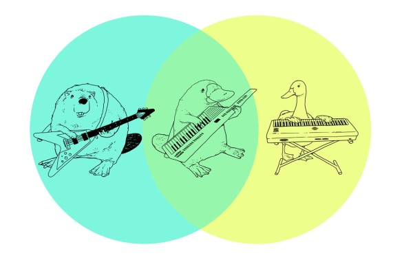
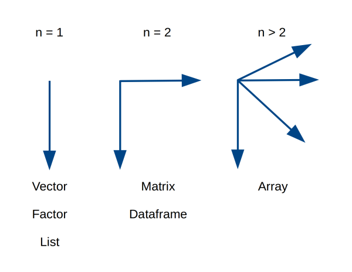
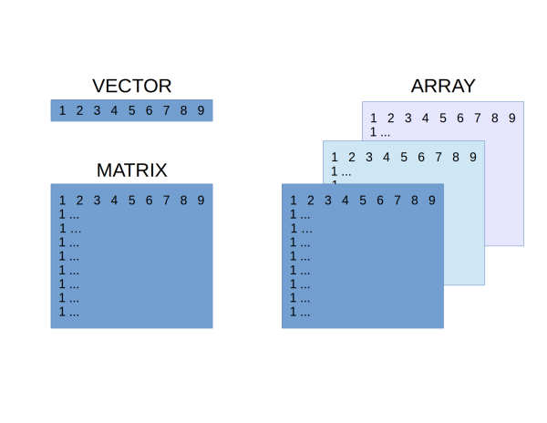
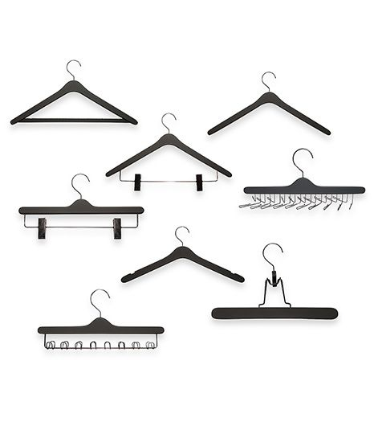

Types of Data and Data Structures in R
========================================================



*R allows you to create new data structures*^[1](http://i18.photobucket.com/albums/b133/endriquelimones/tensographics_math.jpg)^


## Goals

 - Use different data modes.

 - Understand how the different data structures are organised.

 - Create and subset these structures.


# Data: Type


## Data objects in R can take one of certain forms.

These can be put together to create more complex objects.

Data objects can either be restricted to one kind of data, or contain more than one kind.

We will explore the common object types over the next few weeks.


## R has 5 different **classes** of data 

Integer
```
x <- 1:10
```

Numeric
```
x <- c(1.5, 2.5, 3.34, 10.6576)
```

Character or string
```
simon_says <- c("hullo", "my", "name", "is", "Simon")
```

Logical
```
simon_says_again <- c("TRUE", "TRUE", "FALSE", "TRUE", "FALSE", "FALSE")
```

Complex (numbers with real and imaginary parts)
```
1 + 4i
```


# Data: Structures

R has many different data structures

We can put data classes together in many different ways:

 - vector
 - matrix
 - array
 - factor
 - dataframe
 - list


## Data objects have different dimensions




## Data objects can be homogenous or heterogenous 


# Vectors, matrices, and arrays

## The simplest object is a **vector**

A vector can be thought of as equivalent to a single row or single column in a spreadsheet.

A vector is any number of *elements* stuck together.

```r
x <- c(1, 2, 3, 4, 5, 6, 7, 8, 9, 10)
x
```

```
 [1]  1  2  3  4  5  6  7  8  9 10
```

A single element is a vector of length 1.

```r
x <- 1
x
```

```
[1] 1
```

A vector can contain only one class of data (= *atomic* vector).


All elements in a vector are coerced to be the same kind of data.

```r
x <- c(1, 2, 3, 4, "a")
x
```

```
[1] "1" "2" "3" "4" "a"
```

Vectors can be created with `c()` or `vector()`, in which case R will try 
to guess what kind of vector it is. (The default for `vector()` is logical).

```r
vector(length = 5)
```

```
[1] FALSE FALSE FALSE FALSE FALSE
```

Or, you can create specific kinds of vector with `character()`, `numeric()`, and `logical()`. 

```r
character(length = 5)
```

```
[1] "" "" "" "" ""
```


## A **matrix** is a 2D rectangular vector

Matrices are vectors with two dimensions.

Can be created by:

 - sticking vectors together,
 
 - chopping up a longer vector.

```
matrix(1:20, ncol = 5)
     [,1] [,2] [,3] [,4] [,5]
[1,]    1    5    9   13   17
[2,]    2    6   10   14   18
[3,]    3    7   11   15   19
[4,]    4    8   12   16   20
```


## An **array** is a multi-dimensional collection of matrices  

A 3D array in R:
```
> array(1:60, dim = c(4,5,3)) 
, , 1

     [,1] [,2] [,3] [,4] [,5]
[1,]    1    5    9   13   17
[2,]    2    6   10   14   18
[3,]    3    7   11   15   19
[4,]    4    8   12   16   20

, , 2

     [,1] [,2] [,3] [,4] [,5]
[1,]   21   25   29   33   37
[2,]   22   26   30   34   38
[3,]   23   27   31   35   39
[4,]   24   28   32   36   40

, , 3

     [,1] [,2] [,3] [,4] [,5]
[1,]   41   45   49   53   57
[2,]   42   46   50   54   58
[3,]   43   47   51   55   59
[4,]   44   48   52   56   60
```





# Factors

## A **factor** is a vector that represents **categorical** data

Each element comes from a pre-defined set of categories.

Can be:

 - **ordinal** (ordered or ranked): small, medium, large.
 - **nominal** (unordered): blue, yellow, green
 
Factors can be written or coded using any mode (integer, text, logical).


## Factors can be **unordered**


```r
# unordered 3-level factor with integers
x0 <- factor(c(1, 2, 3, 2))
x0
```

```
[1] 1 2 3 2
Levels: 1 2 3
```

```r
table(x0)
```

```
x0
1 2 3 
1 2 1 
```


## Factors can be **unordered**


```r
# unordered 3-level factor with text (default order is alphanumeric)
x1 <- factor(c("large", "small", "medium", "small"))

table(x1)
```

```
x1
 large medium  small 
     1      1      2 
```


## Factors can be **ordered** 


```r
# ordered 3-level factor with text
x2 <- factor(c("large", "small", "medium", "small"), 
             ordered = TRUE,
             levels = c("small", "medium", "large"))

x2
```

```
[1] large  small  medium small 
Levels: small < medium < large
```

```r
table(x2)
```

```
x2
 small medium  large 
     2      1      1 
```


# Dataframes

**Dataframes** can contain different kinds of data

Dataframes are equivalent to a single worksheet in a spreadsheet.

They can contain columns of different kinds of data.

You will likely read your data into R as a dataframe.

```
Year  Colour  Size_mm 
2017  red     23.5
2016  red     12.67
2017  blue    15.2
2016  blue    1.0
...
```


# Lists

A **List** is a recursive vector

Lists can contain any other kind of data (including lists!) in a nested hierarchy.




Lists are like a wardrobe (= closet) where you can store many different kinds of hangers and clothes:

 - There is one main rail (hence it is 1D),
 - You can hang any other object or class else on this rail,
 - Including hanger with other rails (lists).
 
 

# Data object attributes

Objects in R can be examined for their contents with functions such as: `length()`, `class()`, `str()`, `typeof()`.

As well as any attributes: `names()`, `dimnames()`, `dim()`.

You can verify the object type with is.object: `is.vector()`, `is.matrix()`, etc.

You can convert (*coerce*) between atomic vectors with as.object:

```r
as.numeric(c('TRUE', 'FALSE', 'TRUE', 'FALSE'))
```

```
[1] NA NA NA NA
```
... although be careful.


# Special values

## NA

R supports missing data, represented as `NA`. 

## Inf

`Inf` is infinity. You can have either positive or negative infinity.
```
1/0
```


## NaN
`NaN` means Not a Number. It’s an undefined value.
```
0/0
```


# R has many other data structures

- Phylogenetic trees.

- Vector GIS (shape files, ...).

- Spatial point pattern.


 - - -

Updated: 2018-09-10 

