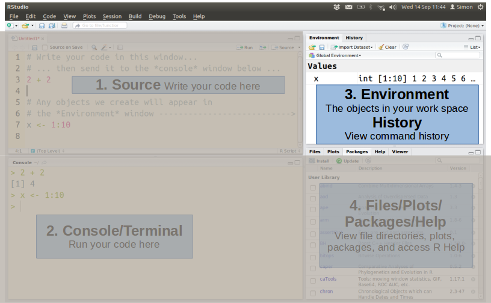
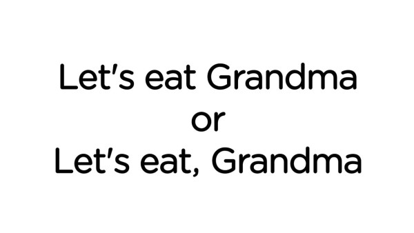

A First Look at R and RStudio
===========================

The way that we interact with R and RStudio is slightly different to much statistics software.

In most other (statistics) software, most people use a point-and-click approach. 

R is different. In R, you have a written conversation with your computer.

Here, we will do a brief tour of R and RStudio.

By the end of the class, you will:

1. Know what all the panels of RStudio are for and what they mean

2. Navigate around the panels and explore their contents

3. Write code in the Source panel and send it to the Console panel.

4. Trouble-shoot some of the common errors when using R.

## The R Graphical User Interface (GUI)

If you open R only (i.e., not RStudio), you will see something like the following.

**Fig. 1.** A long, long time ago on a computer far, far away, ... 

This basic, bare bones GUI features the R console and not much else. 

For this course, we will use [RStudio](https://www.rstudio.com/), a program that sits on top of R, and makes a slightly more user-friendly experience.

## The RStudio GUI

When you open RStudio, this is what you will see.

**Fig. 2.** The RStudio GUI.

What is it and what does it mean?

There are four windows or panes. 

They may be in a different order to here. You can rearrange them under the tabs: Tools > Global Options > Pane Layout.

You can also change their shape similarly to other windows by clicking and dragging, or maximising and minimising.

You can also change the colour scheme as well as text highlighting under: Tools > Global Options > Appearance.

**Fig. 3.** Each pane of the RStudio GUI and its' function.

The basic pattern of work is that you write your code in the Source (1), it is passed to the Console (2), where it is *evaluated* (i.e., run) by R. The Environment (3) and Files (4) windows provide other information or display plots and other outputs.

### 1. Source or Text Editor

**Fig. 4**. RStudio with the Source pane highlighted.

The source is the notepad or editor where you write your code, or R scripts. 

You can open and save as many R scripts as you like. 

Writing and saving a separate file allows you to keep a record of the commands and analysis that you did, rather than try and remember what buttons you clicked, or what code you typed into the R console.

This way of working also allows you to re-use code again and again. You could maybe keep a code library.

*Note:* Keeping records of your data analysis is good practice. Many (natural science) journals now recommend that you upload your data analysis code along with the article. 

*Note:* Files of R code, or R scripts, are usually indicated with a ".R" file extension. If you double click on a .R file, RStudio will automatically open with it. However, you can also work with ".txt" files. If you cannot see the file extensions, you may want to change this option in Windows/Mac.

*Note:* You do not _need_ to write you code in the RStudio Source window. You can open R script in any text editor, e.g., Notepad, BBEdit, gedit, ... Using a Word Processing (e.g., MS Word) program is **not** recommended. This is because word processing software do not create not plain text documents, they often contain other code that is hidden, such as typesetting commands or code in binary that the program needs to work. Any work you submit as a word processor document will be returned without review.

#### Moving code from the Source to the Console

Once you have written your code you need to move it from the RStudio Source Editor.

1. Copy from the Source and paste into the Console. The cursor then is in the Console pane, and you will need to click back in the Source pane to continue editing.

2. Highlight the code, click "Run" in the top right corner of the Source pane. The cursor remains in the Source pane

3. Highlight the code and use a keyboard shortcut: "Control + Enter" (Windows) or "Command + Return" (Mac).

*Note:* You can toggle back and forth between the Source and Console with "Contol + 1" (Source) and "Control + 2" (Console).

### 2. Console (= R)

**Fig. 5.** RStudio with the Console pane highlighted.

The Console is actually R, where your commands are run (or *evaluated*). 

The arrow symbol (">") tells you that R is ready for new code.

If you type "2 + 2" directly into the Console and press Enter, R will evaluate that code immediately and return the output.

In the other command in the image (X <- 1:10), we have created the *object* X. 

There is no output, because there is no answer to show. R stores 'X' in its memory, which you can see in the Environment pane.

### 3. Environment/History

**Fig. 6.** RStudio with the Environment pane highlighted.

The **Environment** tab shows you all the objects (e.g., X) that are currently in your R session.

It also displays a short summary of each object.

The buttons at the top _can_ be used to import data ... but we will not do this, and we will always import data using R code.

The **History** tab shows all the code that has been entered into the Console in this session.

You can scroll back through the code to find something if you need to. You will probably not ever use this.

### 4. Files/Plots/Packages/Help

**Fig. 7.** RStudio with the Files pane highlighted.

This pane is more useful than the Environment/History pane.

The **Files** tab is the equivalent of Explorer or Finder. It shows the file directory structure on your computer's hard drive. You can use it to navigate through to specific directories to read and write files. You can also use it to set the working directory.

The **Plots** tab displays all the plots created in that session. You can scroll backwards and forwards through them, and export using the button (of course, I recommend that you export using a command instead!)

The **Packages** tab allows you to load packages in a point-and-click fashion rather than with commands. It is nice in that you can see all of the available packages currently on your computer.

The **Help** tab displays the R help files. You can search using the search box, or from the Console.

 - - - 

# Further Notes on Scripts and the Console

## Comments: #

The hash or pound symbol ("#") is used in R to indicate a "comment", or a line in the file that is **not** evaluated by R when it is pasted in to the Console.

You can use comments to describe what you code is doing so that in 6 months time you can still understand what you meant!

You can also use comments to "comment-out" a line of code that you want to keep in the file but not run.

## Numbers in the output in square brackets: [1]

You will come across many instances where the data you display in the R console are too big for the window and over-run a single line. 

It will always display [1] for the first *element*.

Then, R tells you how far along that sequence of data you are when the next line starts.

## R is waiting: +

The arrows (>) tells you that R is ready.

The plus sign (+) tells you that R is waiting (very patiently) for something else from you ...

Normally you will need to close out a function.

In any case, you can press ESC to terminate that code, which will not run, and return to the arrow prompt.

 - - -

# On the Importance of Grandma 

Spelling, grammar and syntax are very important in R. And also very frustrating.

R is also case-sensitive. 

Yay.

Most of the errors you will make will most often be due to errors of mispelling in one way or another.

*Always make sure your grammar is safe*

## Spelling

### "Error: could not find function '...'"

Here, R cannot find the function command that you have written. 

Either it is not loaded, or most likely, you have mispelled it.

### "Error: object '...' not found"

Here, the object name that you have typed in is not recognised. 

Please check and try again!

## Punctuation

### White space

White space is great to make your code more readable by people.

White space is not permitted in the names of functions or objects.

### Commas

Commas are used to separate arguments in a function or elements in a vector (more later).

If they are missing, R will not know what goes where.

### Periods

Periods are read as decimal points in numeric data (e.g., 398.2) or as text in the names of objects or functions (e.g., my.function).

### Commas and Periods

Of course, different countries also use commas and periods differently. 

In Latin America, commas are frequently used to indicate decimals, but this issue can be easily resolved when importing data (more later).

 - - - 
 
 Updated: 2018-08-30
 
