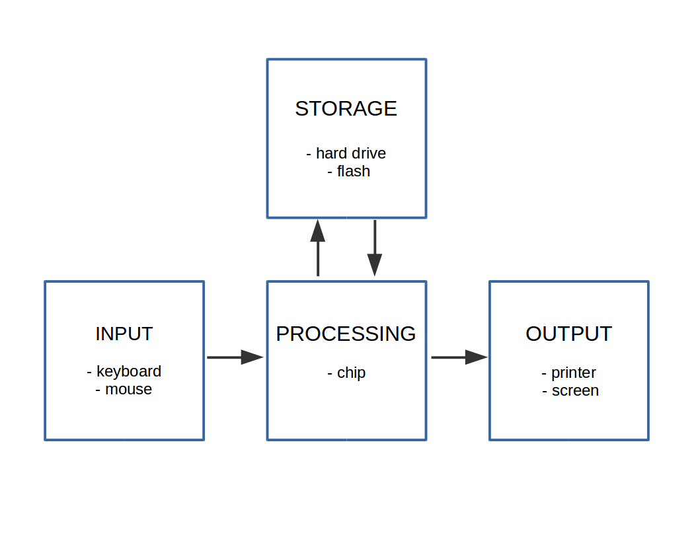
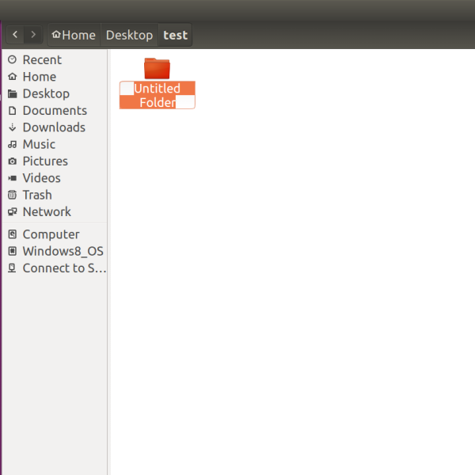

 How Computers Work
========================================================


*Which House will the Apple be in ... ?*


# By the end of today, you will:

1. Understand the different parts of a computer and how they interact

2. Navigate through your computer using the command line

3. Create and delete folders and files


 - - -


## The worst prediction in history?


> The world will need no more than "about five computers"

 - Thomas Watson, IBM Corporation, 1940s


[Source](https://imgs.xkcd.com/comics/number_of_computers.png)


# A computer is an INFORMATION PROCESSOR

Computers take in information or data (INPUT), 

crunch it (PROCESSING), 

spit out the results (OUTPUT), 

and store the data and/or the result (MEMORY).





## Your microwave oven is a very simple computer

INPUT: numbered keypad

PROCESSING: convert key presses to cooking time and temperature

MEMORY: clock

OUTPUT: e.g., Cook for 3 minutes at high temperature ... DINNER!


*$59.99 from Target*


 
## Output ... 
 
 

*Mmm.. dinner*


## Your laptop is a more complex computer

INPUT: keyboard, mouse, scanner, ...

PROCESSING & MEMORY: central processing unit (CPU) interprets and executes program instructions, and communicates with input, output, and secondary storage. It has a small amount of temporary memory.

OUTPUT: screen, printer, video, ...

SECONDARY STORAGE: hard drives, external drives, flash. These can store large amounts of data and software


## HARDWARE is the physical computer and peripherals


*Bits of a computer ...*


## SOFTWARE tells the computer what to do

Planned, step-by-step instructions.

Two kinds of software:

 - System software: Operating system (e.g., Windows, MacOS, Unix)

 - Applications software: Word, Excel, unix programs, .. R!


## An operating system versus permanent physical circuits

Operating systems ...

 - do a variety of DIFFERENT things;

 - INTERACT with the user in COMPLEX ways;

 - can CHANGE what it does and how it interacts


## The operating system is an **intermediary** between applications and hardware

 - It manages the computers resources (CPU, memory, drives, outputs)

 - Establishes a user interface (graphical or command-line)

 - Executes and provides services for applications software.
 
***


 
## User Interfaces allow humans to interact easily with computers

You are probably mostly familiar with GRAPHICAL USER interfaces (GUI, "goo-ee").

GUIs allow users to interact with mouse/finger movements and clicks.


 
## R uses a COMMAND-LINE interface (CLI). 

CLI are less user-friendly at first, but much more powerful:

 - Can keep permanent record of commands  
 
 - Can automate some/many/all steps by calling this record


All personal computers have GUI and CLI access!


## An Application Programming Interface (API) allows software to interact easily 

Analagous to a GUI, but for software 'users'.

Usually an *abstraction* of underlying specific instructions.

Allows software to work on many/all operating systems.

[More here.](https://en.wikipedia.org/wiki/Application_programming_interface)


 - - -
 
# File systems and directory structure

A file system allows us to access specific data/information on a computer.

Naming is derived from office filing systems for paper documents.

"FILE" = a group of data, e.g., a Word document, R code, image, ...

"FOLDER" (or DIRECTORY) =  a collection or group of files.

Can be HIERARCHICAL, i.e., allow subfolders.

"PATH" = Full location of a (sub)directory: e.g., "C:\Simon\Teaching\FES720\"


## Path: The address of a folder or file

It is **hierarchical** like a postal address:

Simon Queenborough  
301 Prospect St  
New Haven  
CT  
USA  


"PATH" = Full location of a (sub)directory: 

```
"C:\Simon\Teaching\FES720\"
```

or file

```
"C:\Simon\Teaching\FES720\myRfile.txt"
```


## Path can be absolute or relative 

The PATH can be **absolute** (i.e., it includes the 'country' and 'state'):

```
"C:\Simon\Teaching\FES720\"
```

Or, **relative** to your working directory. 

If your working directory is 'Teaching/':

```
"FES720\"
```

*Note:* Working with *relative* paths allows your code to transfer between different computers and users much more easily (we will come back to this).


## PATHS: shortcuts

Relative paths can also be specified using shortcut codes.

So, if the working directoy = C:\Simon\Teaching\FES720\

Path = "." indicates the **current working directory**

Path = "." = C:\Simon\Teaching\FES720\


Path = ".." indicates the directory **one level above** the current working directory

Path = ".." = C:\Simon\Teaching\


## Use paths to move files around in your code

Let's assume we have the following hierarchical directory stucture:

```
─ R-project-1
  |   └─ analysis.r
  ├─ raw_data
  |   ├─ 2015
  |   ├─ 2016
  |   └─ 2017
  ├─ processed_data
  |   └─ data_all_yrs.csv
  ├─ results
  └─ figures
      └─ plot1.png
```


## Use paths to move files around in your code

```
─ R-project-1
  |   └─ analysis.r
  ├─ raw_data
  |   ├─ 2015
  |   ├─ 2016
  |   └─ 2017
  ├─ processed_data
  |   └─ data_all_yrs.csv
  ├─ results
  └─ figures
      └─ plot1.png
```


Suppose we want to:
 - read data from raw_data/2015/ and raw_data/2016/, 
 - process it and write the file to processed_data/,
 - read that file in, run an analysis and make a figure to save into figures/


Two ways to move around:

 - **bad:** use setwd() a lot

 - **good**: use relative paths from the main directory (R-project-1/) to read and write 
   


 
# File names

Uniquely identifies a file.

Different OS have different naming conventions and allowed characters.


DRIVE: C:

USER or ROOT: Simon

DIRECTORY: Teaching

SUBDIRECTORY: FES720

FILENAME: myRfile

FILE EXTENSION: .txt


[](https://en.wikipedia.org/wiki/File_system)

***


## File and path names are **TEXT**

```
# You will use this function in the lesson
getwd()

# Notice the speech marks/quotation marks:
"C:\Simon\Teaching\FES720\"
```


 
 
## File systems in Mac, Windows, and Linux
 
 R can run in all three OSs, but there are minor differences.
 
 1. Backslash (\, windows) *vs* slash (Mac, Linux)

 https://www.howtogeek.com/181774/why-windows-uses-backslashes-and-everything-else-uses-forward-slashes/
 
 2. File encodings (non-ASCII text, e.g., text with accents, apostrophes, etc.)
 
 https://en.wikipedia.org/wiki/Text_file
 
 
 3. Line endings (newline, return+newline)
 
 https://en.wikipedia.org/wiki/Newline
 


 
## File utilities allow you to manage the file system 

 In a GUI, you can create, delete, rename, move, copy, change metadata, etc. files and folders.
 
 You can do the same in a CLI.





## File utilities from the CLI allow:

 - automation of data cleaning and processing, 
   - e.g, read in various data files from multiple (sequential?) years, process, and write to new file/s.
   
 - creation and removal of temporary folders and files to store intermediate or temporary steps
   - e.g., in file encoding and unencoding
   
   
 

 
## Further Reading

[Zen and the Art of File and Folder Organization](https://www.howtogeek.com/howto/15677/zen-and-the-art-of-file-and-folder-organization/)


 - - -

Updated: 2018-09-30
