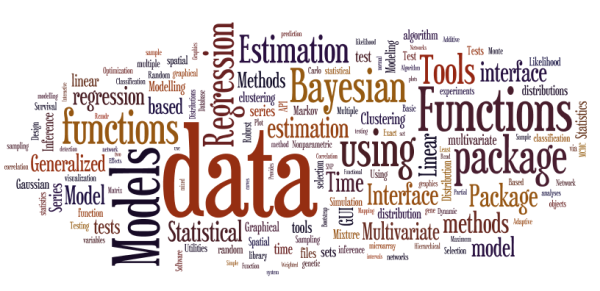

Overview of R, or wizaRds vs muggles
========================================================

# Overview of R

*Don't worry, it will be ok*

## R programming language is a lot like magic... 

... well, a little bit

*Use it wisely, and use it well*

## R users are (like) wizards!

 - R functions =  spells 
 - Spells are free
 - Experienced wizaRds can:
  
   - Create your own spells
   - Spells can change your environment

## SPSS, SAS, JMP, (etc ...) users are like muggles

*How did they do that?!*

 - Unable to change environment
 - Rely on others for spells
 - Have to pay ($)
 - Environment is constrained by SPSS, etc.
 

## Excel is worse ...

 - Functions do random things
 - Errors contained within spells
 - No spellbook to see what is going on
 
 

# What is R?

*eh?*

## R in an intepreted computer language

 - "interpreted" = runs line by line
 - "compiled" = write program, run entire progam (C, FORTRAN)
 
 
 - Most functions written in R
 - Can interface with other (compiled) languages (C, C+, Fortran, etc)
 - Can access system commands (i.e., interact directly with OS)

## History of R

 - S: language for data analysis developed at Bell Labs, circa 1976
 - Licensed as S-plus.
 - R: open source implementation of S in 90s
 - Since 1997: 
   - international R-core team ~15 people
   - 1000s of code writers and statisticians happy to share their libraries! 
   - RStudio, REvolutions, etc.
   

# Advantages of R

 - Fast and free
 - State of the art
 - Active user community
 - Excellent graphics
 - Interfaces with database storage software (SQL)
 - Excellent for simulation, programming, computer intensive analyses, etc.
 - **Forces you to think about your work**

# Disadvantages of R

 - **Forces you to think about your work**
 - Not user friendly @ start
 - Some commercial support
 - Easy to make mistakes and not know
 - Data prep & cleaning 
 - Some users complain about hostility on the R listserve

> I believe functions should do what they say on the box (and the help page), and
not what some user hopes they might do by mind-reading.

   -- Brian D. Ripley
      R-help (November 2004)

# Why learn R

*What just happened ..?!*

## R vs the World

 - Many different datasets (and other “objects”) available at same time
 - Datasets can be of any dimension
 - Functions can be modified
 - Experience is interactive--you program until you get exactly what you want
 - One stop shopping--almost every analytical tool you can think of is available
 - R is free and will continue to exist. Nothing can make it go away, its price will never increase. 

## The World (a.k.a. Commercial software)

 - One dataset available at a given time
 - Datasets are rectangular
 - Functions are proprietary
 - Experience is passive
   - you choose an analysis and they give you everything they think you need
 - Tend to be have limited scope, forcing you to learn additional programs
   - extra options cost more and/or require you to learn a different language (e.g., SPSS Macros)
 - They cost money. 
   - There is no guarantee they will continue to exist, but if they do, you can bet that their prices will always increase

## R is unlimited

 - Probably >1,000 packages
 - Write your own!
 

*That sounds awesome!*

## R can be used for ... 

*That's a lot of wordle*

# Final Words of Warning ...
 
 

> Using R is a bit akin to smoking. 

> The beginning is difficult, one may get headaches
and even gag the first few times. 

> But in the long run, it becomes pleasurable and even addictive. 

> Yet, deep down, for those willing to be honest, there is 
something not fully healthy in it.

 --Francois Pinard

 - - -

Updated: 2018-08-30
