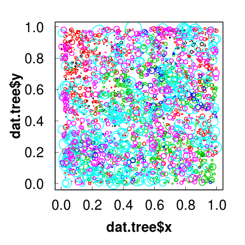

# The Split-Apply-Combine Strategy for Data Analysis

 


**Figure 1.** A map of tree locations in a 1-ha plot. Each circle represents a stem, color indicates species, the size corresponds to the DBH, x- and y-axes are the position.


```r
head(dat_tree)

#      x     y  species  dbh status
# 1 0.078 0.091 blackoak 0.85      1
# 2 0.076 0.266 blackoak 0.90      1
# 3 0.051 0.225 blackoak 1.11      1
# 4 0.015 0.366 blackoak 0.18      0
# 5 0.030 0.426 blackoak 0.32      1
# 6 0.102 0.474 blackoak 0.11      1
```

```r
str(dat_tree)
# 'data.frame':	2251 obs. of  5 variables:
#  $ x      : num  0.078 0.076 0.051 0.015 0.03 0.102 ...
#  $ y      : num  0.091 0.266 0.225 0.366 0.426 0.474 ...
#  $ species : Factor w/ 6 levels "blackoak","hickory",..: 1 ...
#  $ dbh    : num  0.85 0.9 1.11 0.18 0.32 ...
#  $ status  : int  1 1 1 0 1 1 1 0 1 1 ...
```

### Problem: How to calculate mean tree DBH per species?

We can split the dataset up into chunks of rows based on species, and calculate mean DBH for each group.

This is an example of the split-apply-combine approach to data analysis.


## Split-apply-combine is a common data analysis pattern

**Split:** Break a big problem into manageable pieces

**Apply:** operate on each piece independently

**Combine:** stick pieces back together


### Examples of split-apply-combine

**Data preparation**

  - group-wise ranking
  - standardization
  - normalization
  - creating new variables on a per-group basis
  

**Summaries for display or analysis**

  - checking sample sizes of groups
  - calculating marginal means
  - conditioning table of counts by groups
  
**Modelling**

 - fitting separate models for groups (= panel)


With your current knowledge, we could do the following:

## Solution 1: Subset data for each species at a time

```r
# subset out blackoak
bo <-  dat_tree[dat_tree$species == "blackoak", ]

head(bo)
# x     y  species  dbh status
# 1   0.078 0.091 blackoak 0.85      1
# 2   0.076 0.266 blackoak 0.90      1
# 3   0.051 0.225 blackoak 1.11      1
# 4   0.015 0.366 blackoak 0.18      0
# 5   0.030 0.426 blackoak 0.32      1
# 6   0.102 0.474 blackoak 0.11      1

mean(bo$dbh)
# [1] 1.258519
```

*But*, given that we are repeating many of the same steps, this is both tedious and time-consuming, and also increases the chance of errors creeping in to our code.

 
## Solution 2: The *apply group of functions

R has several handy-dandy functions that do this process of splitting the dataset into chunks, applying a calculation, and combining the answers together again.

*Equivalents in other software*: Excel pivot tables, APL's array operators, SQL 'group by operator'.


## The *apply group of functions


### tapply()

*Works on*: vectors and factors (usually in a dataframe)

For when you want to apply a function to subsets of a vector and the subsets are defined by some other vector, usually a factor

`tapply()` has three arguments.

  - `X`: the column of numeric data,
  
  - `INDEX`: one or more factors,
  
  - `FUN`: the function to be applied.

```r
tapply(X = dat_tree$dbh, INDEX = dat_tree$species, FUN = mean)
```
```
blackoak  hickory    maple     misc   redoak whiteoak 
1.258519 2.124154 3.025350 3.394286 9.991156 3.837098 
```

Any arguments to the function can be included.
```r
tapply(dat_tree$dbh, dat_tree$species, mean, na.rm = TRUE)
```
```
blackoak  hickory    maple     misc   redoak whiteoak 
1.258519 2.124154 3.025350 3.394286 9.991156 3.837098
```


You can split the dataframe according to any number of columns, by putting them inside a list.
```r
tapply(dat_tree$dbh, list(dat_tree$species, dat_tree$status), mean)
```
```
                 0        1
blackoak  1.217500 1.265652
hickory   2.339538 2.102210
maple     3.148750 3.010262
misc      4.347500 3.315670
redoak   10.002000 9.989739
whiteoak  3.648913 3.858632
```


### apply()

*Works on*: matrix, array.

When you want to apply a function to the rows or columns of a matrix (and higher-dimensional analogues).

```r
# Two dimensional matrix
M <- matrix(seq(1,16), 4, 4)

M
     [,1] [,2] [,3] [,4]
[1,]    1    5    9   13
[2,]    2    6   10   14
[3,]    3    7   11   15
[4,]    4    8   12   16

# apply min to rows
apply(M, 1, min)
[1] 1 2 3 4

# apply max to columns
apply(M, 2, max)
[1]  4  8 12 16
```

Not generally advisable for data frames as it will coerce to a matrix first.

If you want row/column means or sums for a 2D matrix, look at highly optimized, lightning-quick ``` colMeans() ```, ``` rowMeans() ```, ``` colSums() ```, ``` rowSums() ```


### lapply()

*Works on*: lists (incl. dataframes)

When you want to apply a function to each element of a list in turn and get a list back. 

```r
x <- list(a = 1, b = 1:3, c = 10:100) 

x
$a
[1] 1

$b
[1] 1 2 3

$c
 [1]  10  11  12  13  14  15  ... 100
 
```


```r 
lapply(x, FUN = length) 
$a 
[1] 1
$b 
[1] 3
$c 
[1] 91

lapply(x, FUN = sum) 
$a 
[1] 1
$b 
[1] 6
$c 
[1] 5005
```


### sapply()

*Works on*: lists

When you want to apply a function to each element of a list in turn, but you want a vector back, rather than a list.

```r
x <- list(a = 1, b = 1:3, c = 10:100)

# Compare with above; a named vector, not a list 
sapply(x, FUN = length)  
a  b  c   
1  3 91

sapply(x, FUN = sum)   
a    b    c    
1    6 5005 
```


```r
# lapply:
lapply(x, FUN = sum) 
$a 
[1] 1
$b 
[1] 6
$c 
[1] 5005

# sapply:

sapply(x, FUN = sum)   
a    b    c    
1    6 5005 
```


 - - -

## Other resources

https://nsaunders.wordpress.com/2010/08/20/a-brief-introduction-to-apply-in-r/

https://stackoverflow.com/questions/3505701/grouping-functions-tapply-by-aggregate-and-the-apply-family

https://www.slideshare.net/hadley/plyr-one-data-analytic-strategy


