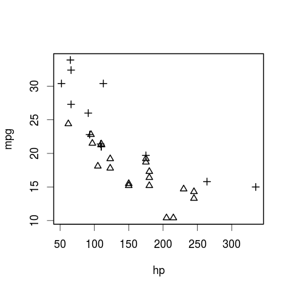

# Extending Regression

In the ANOVA and simple regression models that we have run so far, most of them have been a single response/dependent variable as a function of a single predictor/independent variable. But in many cases we know that there are several things that could reasonably influence the response variable. For example, species and sex could both affect sparrow size; age and sex could both influence running time.

It is straightforward to include multiple predictors. We start with the simple, special case of Analysis of Covariance (ANCOVA), which includes one categorical and one continuous predictor. Multiple linear regression can include any number of categorical and continuous predictors.


# 1. Analysis of Covariance (ANCOVA)

Statisticians realised early on that ANOVA was merely the beginning of analysing experiments---other factors apart from the experimental treatment might influence the response variable they were interested in. 

This issue is especially pertinent when considering change, i.e., does our experimental treatment affect growth or survival? Here, the starting point of each sample is important. If we are measuring growth of seedlings, how big that seedling is at the start of the experiment will have a big affect on its growth. Moreover, if by chance all the big seedlings ended up in one treatment and the small ones in another, we may erroneously assign significance to the treatment.

Thus, analysis of variance with a continuous covariate was born, and we can ask if our treatment had a significant effect, accounting for the measured variation in seedling initial size, for example.

An ANCOVA is able to test for differences in **slopes** and **intercepts** among regression lines: 

 - A difference in **intercept** suggests a differences in magnitude but not in the rate of change, i.e., the regression lines are parallel.

 - A difference in **slope** suggests a difference in the rate of change, i.e., the regression lines are not parallel. 


## Functions

 - `aov()` or `lm()`,

 - `anova()`.


## Example: car mpg

We will illustrate ANCOVA with the `mtcars` dataset that comes with R.

```
data(mtcars)
head(mtcars)
```

```
                   mpg cyl disp  hp drat    wt  qsec vs am gear carb
Mazda RX4         21.0   6  160 110 3.90 2.620 16.46  0  1    4    4
Mazda RX4 Wag     21.0   6  160 110 3.90 2.875 17.02  0  1    4    4
Datsun 710        22.8   4  108  93 3.85 2.320 18.61  1  1    4    1
Hornet 4 Drive    21.4   6  258 110 3.08 3.215 19.44  1  0    3    1
Hornet Sportabout 18.7   8  360 175 3.15 3.440 17.02  0  0    3    2
Valiant           18.1   6  225 105 2.76 3.460 20.22  1  0    3    1
```

The data was extracted from the 1974 _Motor Trend_ US magazine, and comprises fuel consumption and 10 aspects of automobile design and performance for 32 automobiles (1973-74 models).

A data frame with 32 observations on 11 variables:

       [, 1]  mpg   Miles/(US) gallon                        
       [, 2]  cyl   Number of cylinders                      
       [, 3]  disp  Displacement (cu.in.)                    
       [, 4]  hp    Gross horsepower                         
       [, 5]  drat  Rear axle ratio                          
       [, 6]  wt    Weight (1000 lbs)                        
       [, 7]  qsec  1/4 mile time                            
       [, 8]  vs    V/S                                      
       [, 9]  am    Transmission (0 = automatic, 1 = manual) 
       [,10]  gear  Number of forward gears                  
       [,11]  carb  Number of carburetors    


The `mpg` of a car can depend on a number of variables, including the transmission type (`am`) and horse power (`hp`). 

We will model mpg as a function of hp and am and ask if am has a significant effect.

Thus, we take `mpg` as the response variable, `hp` as the predictor variable and `am` as the categorical variable.




### How to specify the ANCOVA models

#### i. The interaction model

Use ` * ` to indicate the interaction between the categorical variable and the covariate.

Put the continuous variable first. This is because R conducts the ANOVA tests sequentially, thus removing (or accounting) for the effect of `hp` before testing for differences between `am`.

```
m1 <- aov(mpg ~ hp * am, data = mtcars)
summary(m1)
```

```
            Df Sum Sq Mean Sq F value   Pr(>F)    
hp           1  678.4   678.4  77.391 1.50e-09 ***
am           1  202.2   202.2  23.072 4.75e-05 ***
hp:am        1    0.0     0.0   0.001    0.981    
Residuals   28  245.4     8.8  
```

The summary shows that horse power and transmission type have significant effects on miles per gallon (the p-values are less than 0.05), but the interaction is not significant.


#### ii. The additive model

Next, run the additive model (use ` + `).

```
m0 <- aov(mpg ~ hp + am, data = mtcars)
summary(m0)
```

```
            Df Sum Sq Mean Sq F value   Pr(>F)    
hp           1  678.4   678.4   80.15 7.63e-10 ***
am           1  202.2   202.2   23.89 3.46e-05 ***
Residuals   29  245.4     8.5   
```

Both horse power and transmission type have a significant effect on miles per gallon.


### How to compare the models


We can compare m0 and m1 with the `anova()` function to assess if removing the interaction significantly affects the fit of the model.

```
anova(m1, m0)
```

```
Analysis of Variance Table

Model 1: mpg ~ hp * am
Model 2: mpg ~ hp + am
  Res.Df    RSS Df  Sum of Sq     F Pr(>F)
1     28 245.43                           
2     29 245.44 -1 -0.0052515 6e-04 0.9806
```

This shows that removing the interaction does not significantly affect the fit of the model (F = 6e-04, p = 0.98). 

Therefore, we conclude that the most parsimonious model is m0, the additive model. The interaction between horse power and transmission type is not significant. 

So mpg will respond similarly to variation in horse power for both automatic and manual cars.


### Plotting the lines, two ways


We can plot `mpg` as a function of `hp`, and include the different `am` using the `pch = ` (plotting character) argument.

```
plot(mpg ~ hp, data = mtcars, pch = am + 2)
```


**Function:**  `abline()` Can take either a model object (for simple regression), or an intercept and slope. 

To add a line for automatic and a line for manual cars, we need to extract the intercept and slope for each type from the model.

Recall that we can use `aov()` and `lm()` interchangeably. 

We can also use `summary()`, `summary.aov()`, and `summary.lm()` interchangeabley, too.

We want to view the coefficient estimates of the linear model.


#### i. Use the original model

```
summary.lm(m1)$coef
```

```
                 Estimate Std. Error     t value     Pr(>|t|)
(Intercept) 26.6248478696 2.18294320 12.19676624 1.014017e-12
hp          -0.0591369818 0.01294486 -4.56837583 9.018508e-05
am           5.2176533777 2.66509311  1.95777527 6.028998e-02
hp:am        0.0004028907 0.01646022  0.02447662 9.806460e-01
```

This table shows the intercept (26.58, first row) and slope (-0.059, second row) of the base level of `am` (which is 0).

The third row gives us the *difference* between the intercept of `am == 1` and `am == 0` (5.28).

The forth row gives us the *difference* between the slopes  of `am == 1` and `am == 0` (0.0004).

We can also access the coefficient estimates with `coef()`

```
coef(m1)
```

```
  (Intercept)            hp            am         hp:am 
26.6248478696 -0.0591369818  5.2176533777  0.0004028907 
```

So, one way to add a line for each transmission type is as follows. 

We can extract the intercept and slope for auto and manual and then pass these values to `abline()`.

```
A_intercept <- coef(m1)['(Intercept)']
A_slope     <- coef(m1)['hp']
A_line       <- c(A_intercept, A_slope)

M_intercept <- A_intercept + coef(m1)['am']
M_slope     <- A_slope + coef(m1)['hp:am']
M_line      <- c(M_intercept, M_slope)
```
```
par(lwd = 2, cex = 1.5)
plot(mpg ~ hp, data = mtcars, 
     pch = am + 2, col = c('black','red')[am + 1])

abline(A_line, col = 'black')
abline(M_line, col = 'red')
```


#### ii. A new model

We can modify the formula to return the actual coefficient estimates for each sex, rather than the differences (see [formulas](http://www.intro2r.info/unit3/formulae.html) for more info on the kinds of formulas we can write).

First, we nest hp in am: `am/hp`. Then, we remove the single intercept using ` - 1`.

(In this case, we also have to convert the `$am` column to a factor within the model.)

```
m2 <- lm(mpg ~ as.factor(am)/hp - 1, data = mtcars)
summary(m2)
```

```
Call:
lm(formula = mpg ~ as.factor(am)/hp - 1, data = mtcars)

Residuals:
    Min      1Q  Median      3Q     Max 
-4.3818 -2.2696  0.1344  1.7058  5.8752 

Coefficients:
                  Estimate Std. Error t value Pr(>|t|)    
as.factor(am)0    26.62485    2.18294  12.197 1.01e-12 ***
as.factor(am)1    31.84250    1.52888  20.827  < 2e-16 ***
as.factor(am)0:hp -0.05914    0.01294  -4.568 9.02e-05 ***
as.factor(am)1:hp -0.05873    0.01017  -5.777 3.34e-06 ***
---
Signif. codes:  0 ‘***’ 0.001 ‘**’ 0.01 ‘*’ 0.05 ‘.’ 0.1 ‘ ’ 1

Residual standard error: 2.961 on 28 degrees of freedom
Multiple R-squared:  0.9825,	Adjusted R-squared:   0.98 
F-statistic: 393.5 on 4 and 28 DF,  p-value: < 2.2e-16
```

This model gives us the actual intercepts and slopes for each sex. The p-values test whether each value is significantly different from 0 (not that useful, because these are the actual values not the differences).

We can then extract these estimates and pass them directly to `abline()` without any calculations.


# 2. Multiple linear regression

Multiple linear regression is simply an extension of linear regression and ANCOVA, with more variables.

Multiple regression allows us to see the relationship between two variables *accounting for other variables in the model*.

Let's continue with the mtcars dataset, and model mpg as a function of hp, am, and another continuous variable, the weight of the car  (`$wt`, in 1000 lbs).

```
m3 <- lm(mpg ~ hp + am + wt, data = mtcars)
summary(m3)
```

```
Call:
lm(formula = mpg ~ hp + am + wt, data = mtcars)

Residuals:
    Min      1Q  Median      3Q     Max 
-3.4221 -1.7924 -0.3788  1.2249  5.5317 

Coefficients:
             Estimate Std. Error t value Pr(>|t|)    
(Intercept) 34.002875   2.642659  12.867 2.82e-13 ***
hp          -0.037479   0.009605  -3.902 0.000546 ***
am           2.083710   1.376420   1.514 0.141268    
wt          -2.878575   0.904971  -3.181 0.003574 ** 
---
Signif. codes:  0 ‘***’ 0.001 ‘**’ 0.01 ‘*’ 0.05 ‘.’ 0.1 ‘ ’ 1

Residual standard error: 2.538 on 28 degrees of freedom
Multiple R-squared:  0.8399,	Adjusted R-squared:  0.8227 
F-statistic: 48.96 on 3 and 28 DF,  p-value: 2.908e-11
```

### Interpretation of the output

We can interpret the output similarly to our previous discussion of linear regression and ANCOVA.

 - `Call: ` The model formula,

 - `Residuals: ` The quartiles of the residuals from the model,

 - `Coefficients: ` 

   + **For continuous predictors** The Estimate and Standard Error for the intercept and slope. Each estimate is the change in y for a change in 1 unit of x. It also includes the t-values and associated p-values testing if the estimates are significantly different from 0.

   + **For categorical predictors** the default is to display the mean of the base level (in this case Species A), and then the *difference* between the mean of each level and the base level. So, here we have the difference between the mean Tarsus size of Species B from Species A. It also includes the t-values and associated p-values testing if the estimates of this difference are significantly different from 0.

 - `R-squared: ` The proportion of the variation in the response variable that is explained by the predictor,

 - `Adjusted R-squared: ` R2 corrected for the number of variables in the model.

 - `F statistic ` From the ANOVA table of the model.


### Considerations 

**Colinearity of the predictors** 

If any of the predictors are strongly correlated, the model may not give sensible estimates for the coefficients. Thus, you should explore the data, plot the variables, and think about the research questions. This may entail including only certain variables in the model, or using a multivariate approach (e.g., PCA) to reduce the number of variables.


**Rescaling the predictors**

If the continuous predictors have very different ranges and scales, it may be hard to sensibly compare the coefficient estimates. Thus, you may want to rescale all the continuous predictors using the function `scale()`. Usually you want to subtract the mean and divide by the standard deviation. The coefficient estimates in the model output are then the change in y for a 1-unit change in the sd of x.


### Make a plot of the coefficient estimates

First, extract the coefficient estimates from the model output, leaving out the top line (the intercept, which we are not usually the interested in for this kind of figure).

```
res <- summary(m3)$coef[-1, ]
res
```

```
      Estimate  Std. Error   t value     Pr(>|t|)
hp -0.03747873 0.009605422 -3.901830 0.0005464023
am  2.08371013 1.376420152  1.513862 0.1412682367
wt -2.87857541 0.904970538 -3.180850 0.0035740311
```

Then, we can plot these values.

```
# plot data in order
plot(1:3 ~ res[, 'Estimate'], 
## set range and label of x-axis
     xlim = c(-4, 4), xlab = 'Estimate',
## do not plot y-axis
     yaxt = 'n', ylab = '')

# add dashed zero line in grey
abline(v = 0, lty = 3, col = 'grey')

# add axis to side 2 (left, the y-axis)
axis(side = 2, at = 1:3, labels = rownames(res), las = 1)

# Then we can add the error bars, using `segments()`
segments(x0 = res[, 'Estimate'] - res[, 'Std. Error'], x1 = res[, 'Estimate'] + res[, 'Std. Error'],
         y0 = 1:3, y1 = 1:3)


# Finally, we can color each point depending on whether is has a significant p-value.
## Set new vector of two colours
COL <- c('white', 'black')
## plot filled points 
points(x = res[, 'Estimate'], y = 1:3, pch = 21, cex = 2,
## with colour based on the P value
       bg = COL[(res[, 'Pr(>|t|)'] < 0.05)+1])
```


