# Using Colour

=======

> "avoiding catastrophe becomes the first principle in bringing color to information: Above all, do no harm.” 

*Envisioning Information*, Edward Tufte, Graphics Press, 1990

=======

# Using Colour

1. Physics of colour

2. Practicalities of colour

3. Accessibiilty of colour

=======

# 1. Physics of Colour

### Colour is 'visible light'

=======

## Describing colour:

### i. Hue, lightness, and colorfulness

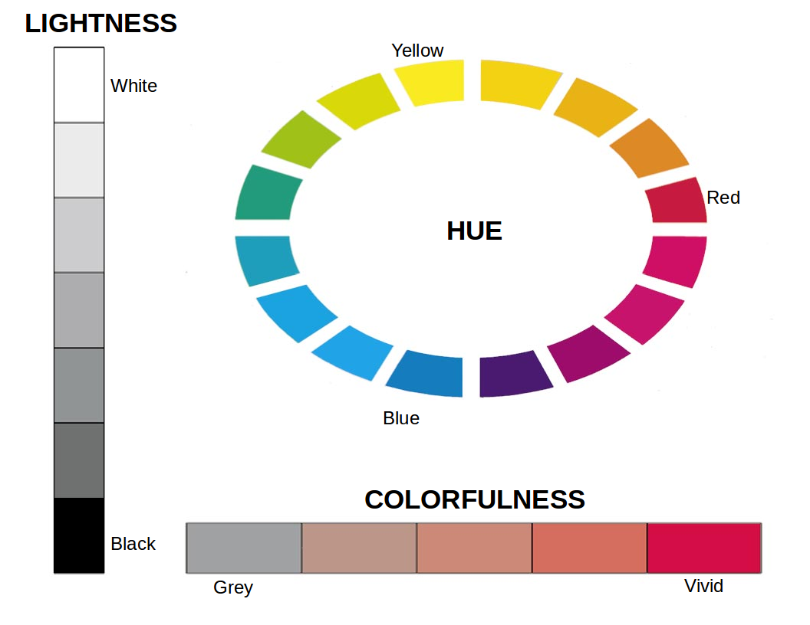

### ii. RGB

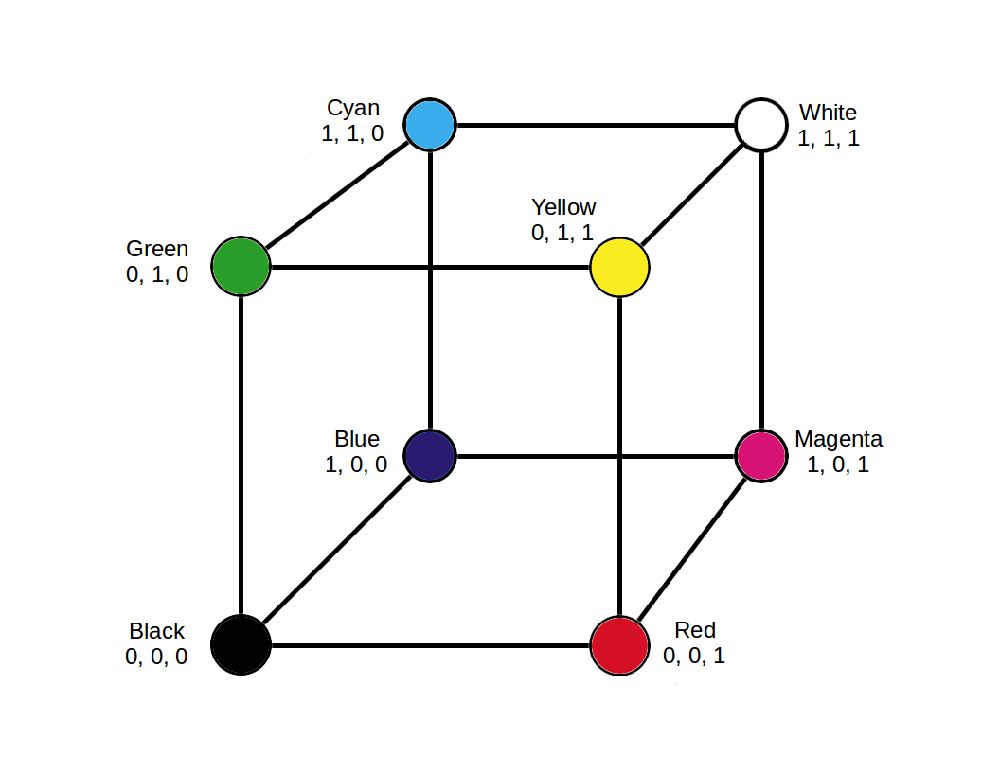

## Background matters:

### Colors look darker and smaller against white and lighter and larger against black. 

### Use a consistent background colour 

 - Avoid gradients of colour
 
 - Avoid any other variation in background colour
 

### Simultaneous contrast can make the **same** colors look **different**

### Simultaneous contrast can make **different** colors look the **same**

## Ensure background contrasts with text and data colours

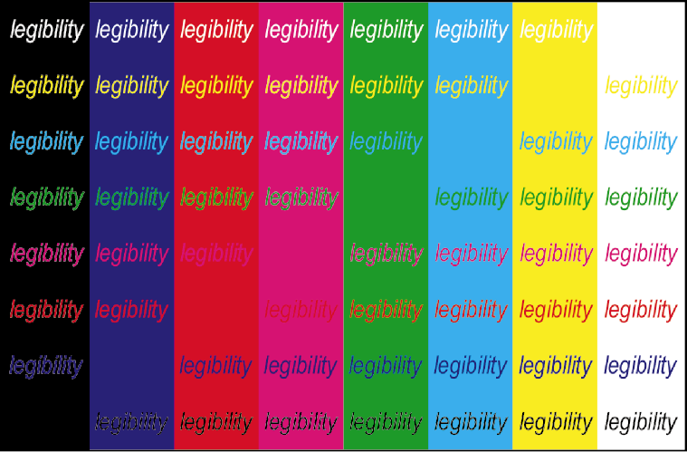

 - Light (e.g., white) and low colourfulness colours (pale greys, creams, etc).
 
 - If using colours to highlight text (e.g., heatmaps) ensure enough contrast.
 

=======

# 2. Practicalities of Colour

## Use color to communicate information

Colour !- decoration / wallpaper.

## Different colors should correspond to different meanings 

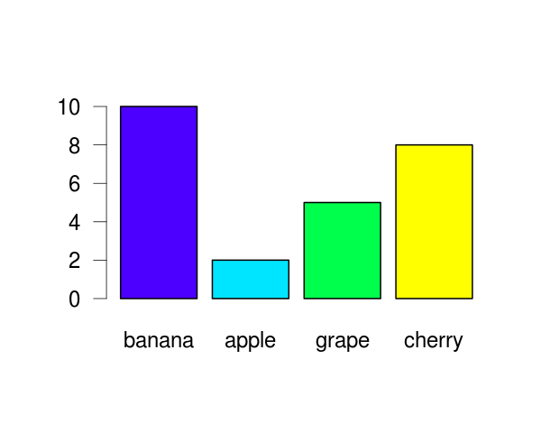

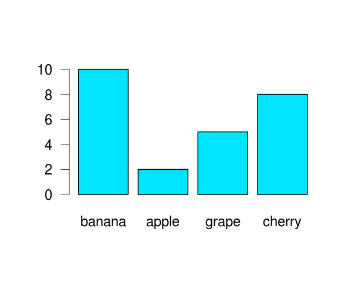

=======

## Three main uses of colour to promote communication:

• To highlight particular data

• To group items (categories)

• To encode quantitative values (sequential or diverging)

## i. Use soft, natural colors to display most information and bright and/or dark colors to **highlight** information

## ii. Use colours of the same hue to group/categorise data

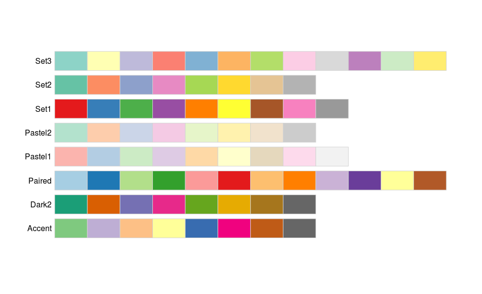

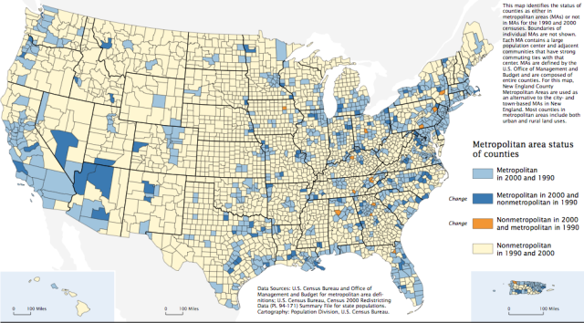

**Fig** A example categorical map from the US census of 2000.

## iii. Use colours of increasing/decreasing brightness or colorfulness to illustrate quantitative data

### Sequential

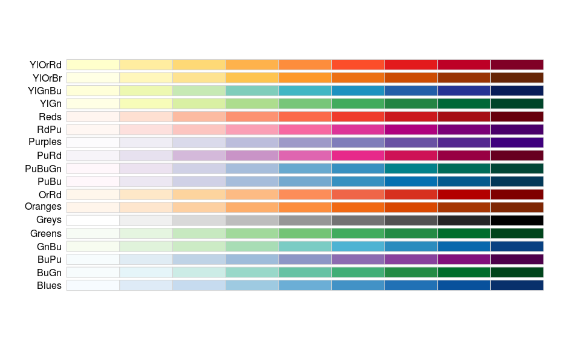

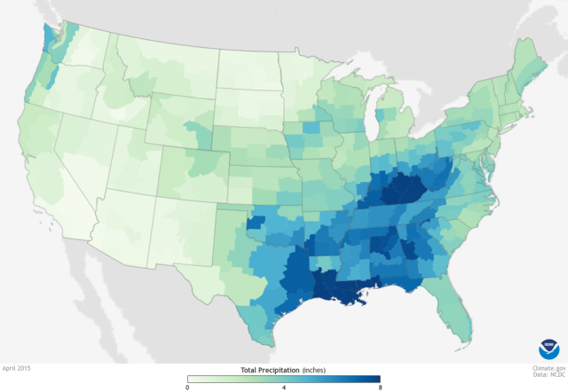

**Fig.** A map of precipitation with a sequential lightness-hue ramp from climate.gov.

## iv. Use colours of increasing/decreasing brightness or colorfulness to illustrate quantitative data

### Diverging

**Fig** A map of temperature anomaly form climate.gov.

## v. Use light colours for non-data components

| Component  | Default Color                                   |
|------------|-------------------------------------------------|
| Axis lines | Thin gray lines of medium intensity.            |
| Borders    | If needed, thin gray lines of medium intensity. |
| Background | Use white or 'None'                             |

### Some suggestions for data components of graphs

 - Use distincts hue of medium intensity for each data series.
 
 - For small data points or thin lines, use distinct hue of high intensity.
 
 - For larger data points or wider lines, use distinct hues of medium intensity.

=======

# 3. Accessibility of Colour

## Red-green **colourblindness** affects:

- about 8% of the male population and

- 0.5% of the female population

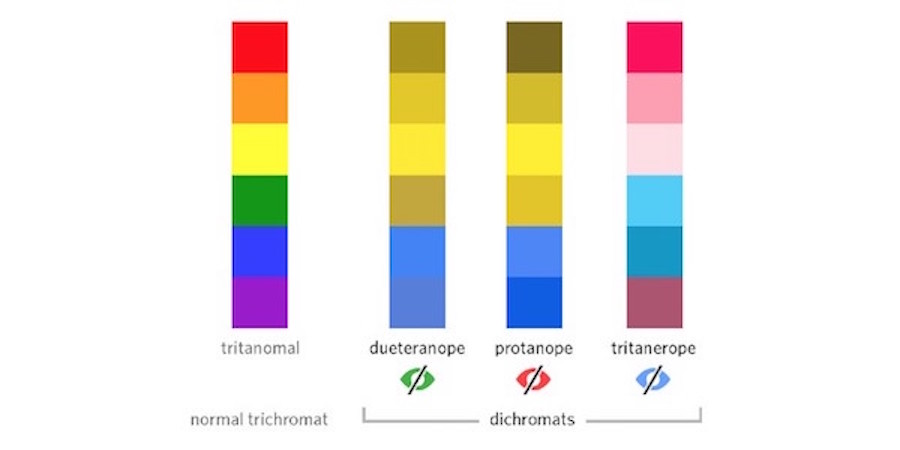

## Recommendations:

### i. Use colour **and** symbols

### ii. Keep colours minimal

### iii. Avoid problem colour combinations

See: [http://blog.usabilla.com/how-to-design-for-color-blindness/](http://blog.usabilla.com/how-to-design-for-color-blindness/)

=======

# Use colorbrewer to help with **everything**!

[http://colorbrewer2.org/](http://colorbrewer2.org/#type=sequential&scheme=BuGn&n=3)

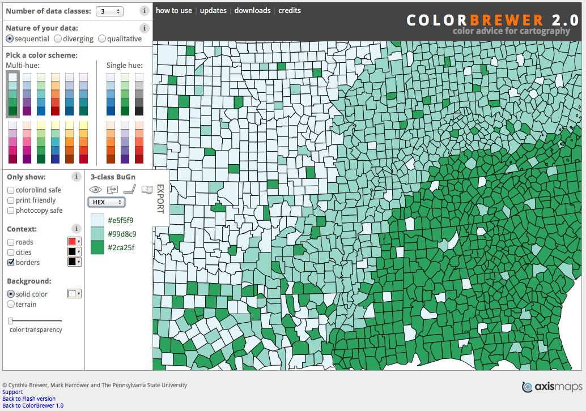

=======

# References

Few, S. 2008. [Practical Rules for Using Color in Charts](http://www.perceptualedge.com/articles/visual_business_intelligence/rules_for_using_color.pdf)

MacDonald, L.W. 1999. [Using Color Effectively in Computer Graphics](http://www.engr.colostate.edu/ECE666/Handouts/WritingPapers/UsingColorEffectively.pdf)

[https://betterfigures.org/2015/06/23/picking-a-colour-scale-for-scientific-graphics/](https://betterfigures.org/2015/06/23/picking-a-colour-scale-for-scientific-graphics/)

[http://blog.usabilla.com/how-to-design-for-color-blindness/](http://blog.usabilla.com/how-to-design-for-color-blindness/)
